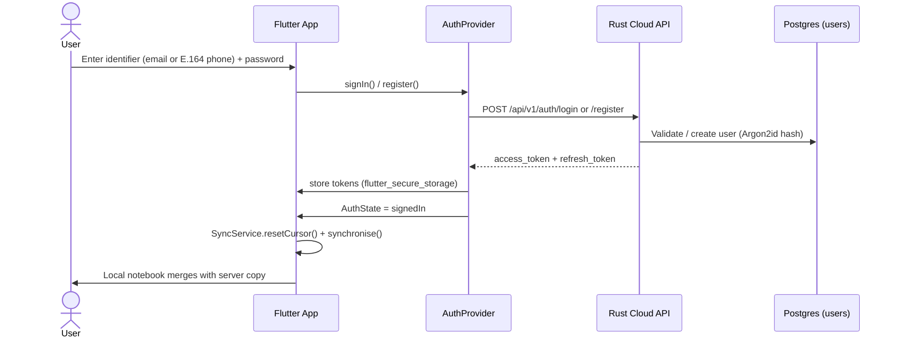
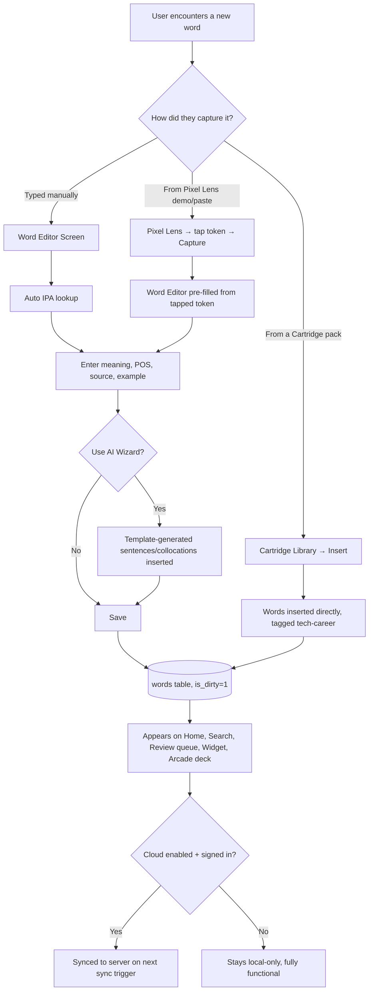
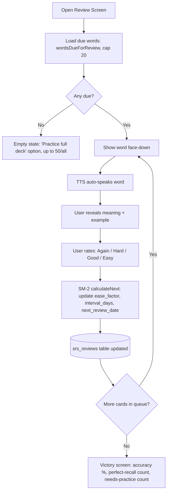
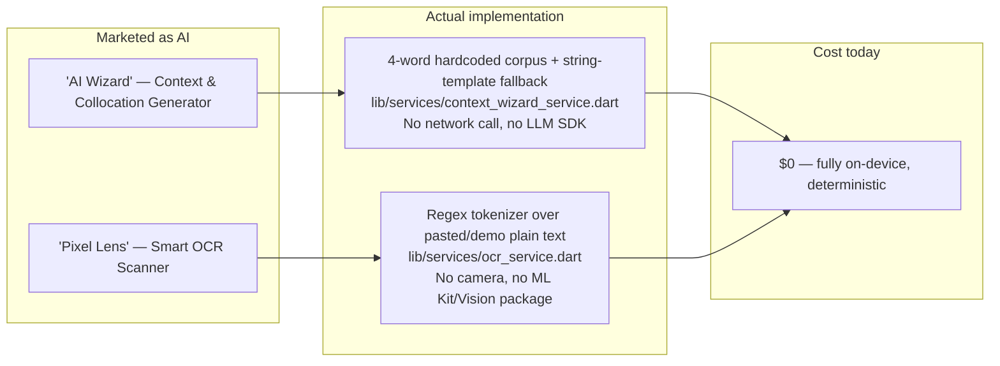
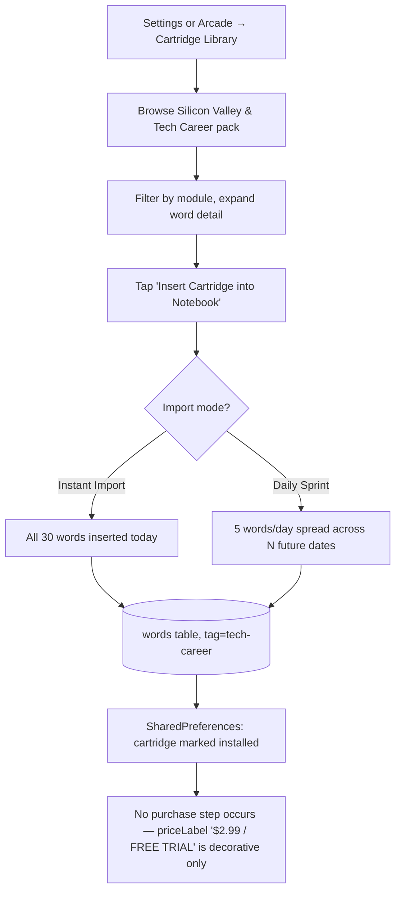

# Veea English Notes — Product Discovery Report

**Prepared by:** Senior Product Engineering / SaaS Product Analysis pass
**Date:** 2026-08-30
**Scope:** Full-repo read-only inspection — Flutter client (`lib/`), Rust cloud backend (`cloud/`), iOS/Android native widget extensions, and supporting assets/tests. No code was modified to produce this report.

> This document is written so that another engineer or AI agent can understand the entire product — what it does, how it's built, and where the money isn't yet — without re-reading the codebase.

---

## 1. Product Overview

### What problem does this product currently solve?

Veea English Notes is a **personal vocabulary journal for adult/professional English learners** (the bundled content and copy strongly imply a Vietnamese-speaking audience — meanings are stored and shown in Vietnamese). It solves the "I keep meeting new English words in my daily life and forget them" problem: a user hears/reads a word in a meeting, a PR review, a podcast, or a book, and needs a fast, frictionless way to log it — with pronunciation, a translated meaning, an example sentence, and a source — before moving on with their day.

On top of capture, it solves a second, harder problem: **retention**. A raw word list is useless if you never revisit it, so the app layers a SuperMemo SM-2 spaced-repetition engine, streak tracking, gamified badges, a virtual pet (currently dormant, see §2.11), home-screen widgets, and nine arcade-style mini-games on top of the same word data, all designed to pull the user back into the app daily.

### Who appears to be the target users?

- **Primary persona:** A Vietnamese professional (the codebase's own sample content — PR review examples, standup phrasing, FAANG interview vocabulary — points specifically at **software engineers / tech workers**) who wants to build English vocabulary passively during daily work and life, not through formal lessons.
- **Secondary/implied persona:** A general adult self-learner who enjoys retro 8-bit game aesthetics and wants a low-friction, offline-capable notebook rather than a structured course (this is explicitly **not** a Duolingo-style curriculum app — there are no lessons, levels, or a syllabus).
- **Tertiary/aspirational persona:** Open-source contributors — the app ships a public "Arcade SDK" (`CONTRIBUTING_GAMES.md`) inviting Flutter developers to build and submit new mini-games, suggesting an ambition toward a community/creator ecosystem.
- **No evidence of:** children, classroom/teacher use, enterprise/B2B buyers, or non-Vietnamese-locale users — nothing in the UI, data, or backend targets these today (see §8 for the gap this creates).

### What are the primary user journeys?

1. **Capture** — see/hear a word → open the app → log it (word, IPA, Vietnamese meaning, part of speech, source, example) in under a few taps.
2. **Retain** — the app resurfaces due words via SM-2 spaced repetition, streak pressure, and a daily home-screen/lock-screen widget.
3. **Reinforce** — the user replays captured vocabulary through arcade mini-games or a hands-free "commute audio" TTS playlist.
4. **Expand** — the user can bulk-import a themed vocabulary set ("cartridge") instead of hand-typing every word.
5. **Persist across devices (optional)** — a user who creates a cloud account gets their notebook synced across phones via a self-hosted Rust backend.

### What is the current value proposition?

*"A frictionless, ad-free, fully-offline personal vocabulary notebook that turns real moments (a PR review, a podcast, a book) into retained English vocabulary — using proven spaced repetition, gamified retro mini-games, and native home-screen widgets, with zero account required and zero mandatory internet connection."*

The value proposition is **currently 100% free** — there is no pricing, subscription, or paywall of any kind live in the product (see §5). Two UI surfaces (a "$2.99" cartridge price label and an "AI Wizard" feature) *gesture* at a future paid tier but are not wired to any purchase mechanism today (see §7).

---

## 2. Existing Features

Each feature below lists: purpose, user flow, frontend files, backend/API touchpoints, DB entities, external services, and a monetization-potential note (elaborated further in §7).

### 2.1 Daily Vocabulary Journal (Home Screen)
- **Purpose:** Chronological, day-by-day log of captured words; the app's home/hub screen and navigation rail to every other feature.
- **User flow:** Open app → date bar + due-review indicator → scroll today's (or a past day's) words → tap a word to edit, "+" to add, or one of 7 top-bar icons to jump to Commute Audio, Arcade, Review, Search, Pixel Lens, Add Word, or Settings. Deleting a word shows an "Undo" snackbar (soft delete).
- **Frontend:** `lib/screens/home_screen.dart`, `lib/widgets/date_bar.dart`, `lib/widgets/word_row.dart`, `lib/providers/vocabulary_provider.dart`.
- **Backend/API:** None directly — reads/writes the local SQLite store only.
- **DB entities:** `words` table (SQLite, see §4).
- **External services:** None.
- **Monetization potential:** **FREE CORE** — gating the base capture/browse loop would break the core value proposition.

### 2.2 Word Editor (Add/Edit a Word)
- **Purpose:** The core capture form — the single most important interaction in the app.
- **User flow:** Enter English word → IPA auto-fills from a bundled offline pronunciation dictionary (with manual override) → enter Vietnamese meaning, part of speech, source, example sentence(s), tags → optional "AI WIZARD" chip opens a context/collocation suggestion sheet → Save (or Delete with undo, if editing).
- **Frontend:** `lib/screens/word_editor_screen.dart`, `lib/widgets/pixel/context_wizard_sheet.dart`.
- **Backend/API:** None — local DB write via `VocabularyProvider.addWord/updateWord/deleteWord`; sync happens asynchronously elsewhere.
- **DB entities:** `words` table; reads `pronunciations` table for IPA lookup.
- **External services:** `PronunciationService` (bundled CMU dictionary asset, fully offline); `ContextWizardService` (fully offline, template-based — **not a live AI call**, see §6).
- **Monetization potential:** Base form is **FREE CORE**. The "AI Wizard" chip is a strong **PREMIUM** candidate *if and when* it is upgraded from static templates to a real LLM call (see §7).

### 2.3 Spaced Repetition Review ("Review Screen")
- **Purpose:** SuperMemo SM-2 flashcard review, framed as an 8-bit RPG battle sequence, to drive long-term retention.
- **User flow:** Open → queue of due words loads (capped at 20 by default, or up to 50/full deck via "Practice All") → word shown face-down → reveal meaning/example → rate recall (Again/Hard/Good/Easy, 1–4 keys) → SM-2 reschedules the word → advances → "STAGE CLEARED!" victory screen shows accuracy and per-rating counts.
- **Frontend:** `lib/screens/review_screen.dart`.
- **Backend/API:** None directly; writes flow through `VocabularyProvider.recordSrsReview()` → local DB; synced later if cloud is enabled.
- **DB entities:** `srs_reviews` table (SM-2 state, FK → `words`).
- **External services:** TTS auto-speaks each card.
- **Monetization potential:** **FREE CORE.** The review-queue cap (currently a hardcoded 20/50) is a plausible soft **FREE WITH LIMIT / PREMIUM** upsell lever without touching the core mechanic.

### 2.4 Search
- **Purpose:** Full-text, diacritic-insensitive search across all captured words (not just "today," unlike Home).
- **User flow:** Tap search icon → type (180ms debounce) → results list → tap to open in Word Editor. Vietnamese diacritic folding means "kien cuong" matches "kiên cường".
- **Frontend:** `lib/screens/search_screen.dart`, `lib/models/text_normalizer.dart`.
- **Backend/API:** None — local SQLite query against a precomputed `search_text` column.
- **DB entities:** `words.search_text` (indexed).
- **External services:** None.
- **Monetization potential:** **FREE CORE.**

### 2.5 Settings / Account (merged screen)
- **Purpose:** One screen combining cloud account management, gamification stats display, the cartridge-library entry point, theme selection, and home/lock-screen widget configuration. (`account_screen.dart` is a 1-line re-export of `settings_screen.dart` — there is no separate account screen.)
- **User flow:** If no cloud server is configured, shows a "runs fully local" notice only. If cloud-enabled and signed out: identifier (email or E.164 phone, auto-detected) + password → sign in/register. If signed in: Sync Now, Export vocabulary (JSON, copied to clipboard), Change password, Sign out, Delete account (destructive, requires password re-entry). Below that: a 16-week GitHub-style activity heatmap, a milestone-badge grid, a Cartridge Library promo card, the 6-theme picker, and widget settings (rotation interval, pronounce-on-tap, rotate-on-open, daily reminder toggle).
- **Frontend:** `lib/screens/settings_screen.dart` (991 lines), `lib/widgets/pixel/pixel_heatmap.dart`, `lib/widgets/pixel/pixel_badges_grid.dart`.
- **Backend/API:** `AuthApi.register/login/logout/getMyProfile/deleteAccount/changePassword/changeIdentifier/exportWords`; `VocabularyApi.sync` (via `SyncService`).
- **DB entities:** `words` (export); server-side `users`, `refresh_tokens`.
- **External services:** `flutter_secure_storage` (auth tokens), `SharedPreferences` (widget/cartridge prefs), `home_widget` package.
- **Monetization potential:** The screen itself is **FREE CORE infrastructure**, but it is the natural home for a future paywall/upgrade entry point (the cartridge promo card already lives here).

### 2.6 Cloud Account & Cross-Device Sync
- **Purpose:** Optional account creation so the same vocabulary notebook is available on multiple devices. Entirely opt-in — the app is fully functional signed-out.
- **User flow:** See §3.1/§3.2 journeys below.
- **Frontend:** `lib/providers/auth_provider.dart`, `lib/services/sync_service.dart`, `lib/data/remote/{api_client,auth_api,vocabulary_api,token_store}.dart`.
- **Backend/API:** Full Rust/Axum REST API — `/api/v1/auth/register|login|refresh|logout`, `/api/v1/users/me` (get/delete), `/api/v1/users/me/password`, `/api/v1/users/me/identifier`, `/api/v1/users/me/export`, `/api/v1/vocabulary/sync`, `/api/v1/vocabulary/words`, `/api/v1/admin/users*`.
- **DB entities:** Postgres `users`, `refresh_tokens`, `words`, plus `outbox_events`/`inbox_messages`/`idempotency_records` (infrastructure tables, not user-facing data).
- **External services:** PostgreSQL 17, Redis 7 (rate limiting/idempotency), NATS (event bus, feature-flagged Kafka alternative).
- **Monetization potential:** **NOT SUITABLE FOR MONETIZATION as a gate on its own** (charging for basic account/sync would be unusual and user-hostile for a notes app), but cloud infrastructure is the **prerequisite plumbing** for every server-enforced paid tier described in §7 — entitlements, quotas, and receipt validation would all be built on top of this identity system.

### 2.7 Automatic IPA Pronunciation & Offline Dictionary
- **Purpose:** Auto-fills IPA transcription for any of ~126,000 English words without the user needing an IPA keyboard.
- **User flow:** Type a word in the editor → IPA appears automatically; user may still hand-edit it.
- **Frontend:** `lib/services/pronunciation_service.dart`.
- **Backend/API:** None.
- **DB entities:** SQLite `pronunciations` table, bulk-imported once from a bundled gzip asset (`assets/pronunciation/en_us_ipa.txt.gz`, CMU Pronouncing Dictionary derivative).
- **External services:** None — fully offline, in-memory LRU cache (500 entries) over a SQLite lookup.
- **Monetization potential:** **FREE CORE.**

### 2.8 Text-to-Speech Pronunciation
- **Purpose:** Spoken audio for any word, meaning, or example sentence, throughout the app (Word Editor, Review, Home widget tap, Arcade games, Audio Commute).
- **Frontend/Service:** `lib/services/tts_service.dart`, wrapping `flutter_tts`.
- **External services:** Native OS TTS engine (AVSpeechSynthesizer on iOS, Android TextToSpeech) — **fully on-device, zero network cost.**
- **Monetization potential:** **FREE CORE** (it's a utility underlying many other features, not a standalone product).

### 2.9 Native Home Screen & Lock Screen Widget ("Word of the Day")
- **Purpose:** Passive daily exposure — a rotating word (with IPA, meaning, example, streak count) shown directly on the phone's home/lock screen, tappable for TTS pronunciation or manual rotation.
- **User flow:** Enable in Settings → widget appears on home/lock screen → tap word to hear pronunciation (if "pronounce on tap" enabled) or to rotate to the next word → widget auto-rotates on a configurable interval (15/30/60 min, or static).
- **Frontend:** `lib/services/widget_service.dart`, `lib/providers/widget_provider.dart`, `lib/widgets/word_of_day_widget_card.dart`.
- **Native:** iOS — `ios/WordOfDayWidget/WordOfDayWidget.swift` (WidgetKit + AppIntents, `NextWordIntent`), sharing data via an App Group (`group.com.nintran.veeaEnglishApp`, `com.apple.security.application-groups` entitlement on both the main app and the widget extension). Android — `AppWidgetProvider` + `word_of_day_widget.xml`/`word_of_day_widget_info.xml`.
- **Backend/API:** None.
- **DB entities:** No dedicated table — reads the current word list from `VocabularyProvider` and pushes a JSON blob into shared native storage on every DB change (not just app-open).
- **External services:** `home_widget` Flutter package.
- **Monetization potential:** **FREE CORE / light PREMIUM lever.** The base widget is a strong retention/acquisition feature and should stay free; advanced customization (multiple widgets, custom rotation sources, richer lock-screen styles) could be a minor premium add-on.

### 2.10 Six Retro Pixel Themes
- **Purpose:** Visual personalization — Paper Light, Night Dark, GameBoy Matrix Green, Cyberpunk Neon, OLED True Black, System Default.
- **Frontend:** `lib/providers/theme_provider.dart`, `lib/core/theme/{pixel_theme,pixel_palette,pixel_metrics}.dart`.
- **Backend/API:** None. Persisted locally (`SharedPreferences`).
- **Monetization potential:** **PREMIUM (cosmetic) candidate.** Cosmetic unlockable themes are one of the lowest-risk, most standard monetization levers in consumer apps (e.g., lock 2–3 of the 6 themes, or add new theme packs over time) — currently all 6 are free.

### 2.11 Gamification: Streaks, Badges & Activity Heatmap
- **Purpose:** Drives daily engagement through visible progress — an 11-badge milestone system (Collection/Streak/Mastery/Exploration categories) and a 16-week contribution-style heatmap, both computed live from real usage stats (no server round-trip).
- **Frontend:** `lib/models/gamification_badge.dart`, `lib/widgets/pixel/{pixel_badges_grid,pixel_heatmap}.dart`.
- **DB entities:** Derived at query time from `words` and `srs_reviews` — no separate badges table.
- **Monetization potential:** **FREE CORE** as an engagement driver, but exclusive/cosmetic badge sets are a plausible small **PREMIUM** add-on later.

### 2.12 Virtual Pet Companion ("Veea-chi") — *dormant*
- **Purpose (as built, not currently live):** An 8-bit virtual pet that gains XP and evolves through 4 stages (Egg → Hatchling → Cyber Pup → Mecha Dragon) as the user logs words ("feeds" it), with mood tied to streaks and due-review backlog.
- **Status:** `PetProvider` is still registered globally in `lib/main.dart:200` and fully implemented (`lib/models/pet_companion.dart`, `lib/providers/pet_provider.dart`, `lib/widgets/pixel/pet_companion_widget.dart`), but **the widget that renders it is not referenced by any screen** — commit `4156ecf` ("remove Veea-chi companion... from homepage for clean aesthetic") pulled it from the UI. It is dead weight today, not a shipping feature.
- **Monetization potential:** **NOT SUITABLE while dormant.** If reactivated, a pet-customization/cosmetics layer (skins, accessories, alternate evolution paths) would be a natural **PREMIUM** lever — this is flagged as a quick win to revive.

### 2.13 Cartridge Library (Thematic Vocabulary DLC Packs)
- **Purpose:** Bulk-import curated, professionally-written vocabulary sets instead of hand-typing every word — currently one pack exists: **"Silicon Valley & Tech Career"** (id `silicon_valley_tech_vol1`), 30 words (`tech_001`–`tech_030`) across 6 modules (Architecture, PR Review, Standup & Sprint, Incident & RCA, Interview & STAR, Product Strategy), each word carrying a PR-review example sentence, a standup example sentence, collocations, and an "interview nuance" tip.
- **User flow:** Open from Settings or Arcade top bar → browse hero card (title, price label, "BEST SELLER ★" badge) → filter by module → expand a word card for full detail → "Insert Cartridge into Notebook" → choose **Instant Import** (all words dated today) or **Daily Sprint** (5 words/day spread over N days) → words are inserted into the real `words` table, tagged `tech-career` → "Remove" uninstalls cartridge-tagged words the user hasn't hand-edited.
- **Frontend:** `lib/screens/cartridge_library_screen.dart`, `lib/providers/cartridge_provider.dart`, `lib/data/cartridges_data.dart`, `lib/models/cartridge.dart`.
- **Backend/API:** None — content is bundled static Dart data; install state is local (`SharedPreferences`).
- **DB entities:** Writes into `words` like any manually captured word.
- **External services:** TTS per-word playback.
- **⚠️ Key finding:** The cartridge already carries a hardcoded **`priceLabel: '$2.99 / FREE TRIAL'`** and **`badgeLabel: 'BEST SELLER ★'`** (`lib/data/cartridges_data.dart:14-15`) — but there is **no `in_app_purchase` package, no purchase flow, no receipt validation, and no entitlement check anywhere**. `CartridgeProvider.installCartridge()` installs the full pack for free and unconditionally today. There is also a **copy/data mismatch**: the description claims "300+ ... vocabulary terms" but only 30 words are actually bundled.
- **Monetization potential:** **PREMIUM — the single clearest, most fully-formed monetization hook already in the codebase.** It needs a purchase/entitlement layer wired to the UI that already exists, plus more cartridges built to the same schema (e.g., IELTS, medical, legal, sales vocab packs).

### 2.14 8-Bit Retro Arcade Center (9 Mini-Games)
- **Purpose:** Turns spaced repetition into active, replayable arcade gameplay to increase session frequency and fun-factor. Games: Word Rush 60s (speed quiz), Vocab Snake, Vocab Invaders (shooter), Breakout Vocab, Vocab Frogger, Vocab Chomp (Pac-Man-style), Word Stacker (Tetris-style), Vocab Angler (fishing), Pixel Duel 1v1 (turn-based).
- **User flow:** Home → Arcade → scroll "game cabinet" cards (icon, title, badge, author/version, tagline) → Play → full-screen game session using the player's own vocabulary deck (each game requires a `minWordsRequired`, default 4 words, before it's playable) → in-session score/lives/combo tracking.
- **Frontend:** `lib/screens/arcade_screen.dart`, `lib/screens/games/*.dart` (9 files), the **Arcade SDK**: `lib/arcade_sdk/{contracts,components,registry,templates,context}/*.dart`.
- **Backend/API:** None.
- **DB entities:** Reads the `words` table via `ArcadeGameContext.getVocabularyDeck()`; game hits also call back into SRS recording (`recordHit`).
- **External services:** TTS pronunciation on word hits.
- **⚠️ Key finding:** 5 of 9 games have a **lives system**, 3 have a **combo/multiplier system**, but **no game persists a high score** — there is no cross-session leaderboard, best-score tracking, currency, energy system, ad placement, or unlockable-content mechanic anywhere in the 9 game files. This is real, ready-to-extend infrastructure sitting unused.
- **Monetization potential:** **FREE CORE for the games themselves** (this is a major differentiator and daily-engagement driver — gating it would hurt retention). **Persisted high scores/leaderboards, extra lives, cosmetic skins, or exclusive games are strong PREMIUM/FREE-WITH-LIMIT candidates** layered on top of existing lives/score/combo plumbing.

### 2.15 Arcade SDK & Community Game Contribution Model
- **Purpose:** A public contract (`ArcadeGameManifest`, `ArcadeGameContext`, `ArcadeVocabWord`) plus shared retro-UI components (`ArcadeCrtScreen`, `ArcadeSplitControls`, `ArcadeParticle`, `ArcadeFallingBadgesOverlay`) and a documented 5-step guide (`CONTRIBUTING_GAMES.md`) so external Flutter developers can build and PR in new mini-games.
- **Frontend:** `lib/arcade_sdk/` (registry pattern, `ArcadeGameCategory.community` category already modeled), `lib/arcade_sdk/templates/starter_template_game.dart` as a working reference implementation.
- **Monetization potential:** **NOT SUITABLE FOR DIRECT MONETIZATION**, but strategically valuable — a creator/contributor ecosystem is a durable content moat competitors can't easily copy, and could later support a revenue-share or "featured community cartridge/game" model.

### 2.16 "Pixel Lens" Smart Scanner — *mock/demo feature, not real OCR*
- **Purpose (as marketed):** "8-Bit Retro Pixel Lens Smart OCR Camera & Screenshot Sniffer" — scan text from the real world (a book, a screen) and tap detected words to capture them.
- **What it actually does:** There is **no camera integration and no OCR/image-recognition technology anywhere in this feature.** `OcrService.processText()` (`lib/services/ocr_service.dart:44`) is a pure-Dart plain-text tokenizer: it splits text into lines/words via regex, fabricates fake bounding boxes from character-position heuristics purely for the "scanner HUD" visual effect, and matches words to sentences via regex sentence-splitting. It operates only on (a) 3 bundled hardcoded demo texts ("PR Review", "Tech News", "Essay"), or (b) text the user manually pastes into a "Paste Text / OCR Snippet" dialog.
- **User flow:** Home → Pixel Lens → pick a demo source or paste text → tap any word in the "Interactive Token Cloud" → inspection dock shows IPA + sentence context → "Capture to Notebook" opens the Word Editor pre-filled.
- **Frontend:** `lib/screens/pixel_lens_screen.dart`, `lib/services/ocr_service.dart`.
- **Backend/API:** None. **No `camera`, `image_picker`, `google_mlkit_text_recognition`, or any vision package is present in `pubspec.yaml`.**
- **Monetization potential:** **NOT SUITABLE FOR MONETIZATION as currently built** — charging for a feature with no working camera/OCR pipeline behind it would be misleading to users. **If rebuilt with a real on-device or cloud OCR pipeline, this becomes a strong PREMIUM candidate** (camera-to-vocabulary capture is high perceived value and a natural iOS/Android differentiator). This is the most important expectation-vs-implementation gap in the product and should be resolved (either build it or rename/reframe it) before any monetization push.

### 2.17 "AI Wizard" Context & Collocation Generator — *template-based, not LLM-backed*
- **Purpose (as marketed):** "8-Bit Retro AI Context & Collocation Wizard" — generates example sentences across 3 life domains (Work, Reading, Daily Conversation), common collocations, and nuance comparisons against near-synonyms, to deepen understanding of a captured word.
- **What it actually does:** `ContextWizardService.generate()` (`lib/services/context_wizard_service.dart:38`) is fully synchronous, offline, and deterministic: it checks a hardcoded dictionary of exactly **4 fully hand-authored words** (resilient, tenacious, eloquent, serendipity), and for every other word falls back to simple string interpolation into 3 fixed sentence templates (e.g. `"Our architecture is designed to be highly $word under heavy production traffic."`) and the **same two hardcoded nuance synonyms** ("persistent"/"tenacious") regardless of the input word. **There is no LLM call, no network request, and no real natural-language generation.**
- **User flow:** Word Editor → tap "AI WIZARD" chip → bottom sheet shows generated sentences/collocations/nuances → tap to insert into the example field.
- **Frontend:** `lib/widgets/pixel/context_wizard_sheet.dart`, `lib/services/context_wizard_service.dart`.
- **Monetization potential:** **NOT SUITABLE FOR MONETIZATION as currently built** (the output quality for any word outside the 4-word corpus is generic template text, not worth charging for). **This is the single best "build it real" investment in the product**: replacing this with an actual LLM call (Claude/GPT/etc.) would immediately become one of the strongest **PREMIUM** upsell features, since the UI, entry point, and user expectation already exist — only the backend is missing (see §6 and §7).

### 2.18 Audio Commute (Hands-Free TTS Playlist)
- **Purpose:** A passive-listening mode — auto-plays the user's saved vocabulary as a spoken playlist (word → recall pause → meaning → optional example → next), styled as an animated 8-bit cassette Walkman, intended for commuting/hands-free use.
- **User flow:** Open from Home or Review screen → playlist auto-loads and starts playing → transport controls (shuffle, prev/play-pause/next, loop) → configurable recall-pause (1/2/3/5s) and repeat-count-per-word (1–3×) → 3 playback modes (word+meaning, word+meaning+example, word-only).
- **Frontend:** `lib/screens/audio_commute_screen.dart`, `lib/services/audio_commute_service.dart`.
- **Backend/API:** None.
- **External services:** `flutter_tts`, sequenced through an internal state machine — no separate audio file generation/caching, everything is spoken live.
- **Monetization potential:** **PREMIUM candidate.** A genuinely differentiated "passive learning" use case beyond core CRUD; natural to offer full customization (filters by tag/date range, unlimited playlist length) as paid, with a capped/simplified version free.

---

## 3. User Journeys

### 3.1 Registration / Login

Notes:
- The app is **fully usable signed-out** — this journey is entirely optional, gated by whether a build was compiled with `VEEA_API_BASE_URL` (`AppConfig.isCloudEnabled`).
- One `identifier` field auto-detects email vs. phone; phone numbers must be E.164 (`+` prefixed) — a bare local-format number is rejected to avoid guessing the wrong country.
- On a 401, `ApiClient` transparently refreshes the access token once and replays the request; concurrent 401s share one in-flight refresh to avoid a refresh race.

### 3.2 Onboarding (first run)

There is **no dedicated onboarding flow, tutorial, or welcome screen** anywhere in the codebase (confirmed — no `onboarding_screen.dart` or equivalent exists). A first-time user lands directly on an empty Home Screen. The closest thing to onboarding is:
- The Word Editor's inline hints and the auto-IPA lookup, which teach the capture flow implicitly.
- The Pixel Lens screen's 3 bundled demo texts, which let a user try word-capture without having real content to paste.
- The Arcade's `minWordsRequired` gate (games unlock only once a few words exist), which nudges the user toward capturing before playing.

This is a notable gap — see §8.

### 3.3 Word Capture (Learning / Vocabulary — core loop)

### 3.4 Spaced Repetition Review (Quiz/Test flow)

### 3.5 AI Features (current reality vs. framing)

**Neither feature makes any external AI API call today.** Both are strong candidates to become *real* AI features (LLM-backed generation, on-device or cloud OCR) — see §6 and §7 for the cost and monetization implications of doing so.

### 3.6 Progress Tracking

- **Streaks:** computed from consecutive days with ≥1 captured word (`GamificationStats.currentStreak`/`maxStreak`), shown as a flame badge on Home and Review.
- **Activity heatmap:** 16-week GitHub-style contribution grid (`PixelHeatmap`), Settings screen.
- **Milestone badges:** 11 fixed badges across 4 categories (Collection, Streak, Mastery, Exploration) — all computed live from `words`/`srs_reviews`, no separate badge-state table (§2.11).
- **Widget streak display:** the native home-screen widget also shows the current streak count.
- No historical trend charts, no weekly/monthly summary emails or push notifications, no "words retained vs. forgotten" analytics exist.

### 3.7 Content Creation (Cartridges)

### 3.8 Teacher/Admin Features

- **Admin role exists at the backend only**: `UserRole::Admin` (`cloud/src/domain/identity/value_objects/user_role.rs`) gates `GET /api/v1/admin/users` (list all users, paginated) and `PUT /api/v1/admin/users/:id/role` (change a user's role) via `role_guard` middleware.
- **No admin UI exists in the Flutter app** — these endpoints are only reachable via direct API calls (e.g. `curl`), not through any screen.
- **No teacher-specific concept exists anywhere** — no classrooms, no assigning cartridges/word lists to students, no shared/managed vocabulary sets, no student progress dashboards. This is a complete gap, not a partial one (see §8).

---

## 4. Current Technical Architecture

### Frontend — Flutter mobile app (`lib/`)
- **Framework:** Flutter (Dart SDK ^3.10.0), Material-based but fully re-skinned with a custom "8-bit pixel" design system (`lib/core/theme/`, `lib/widgets/pixel/`).
- **State management:** `provider` (^6.1.2) — `ChangeNotifier`-based providers wired at the app root in `lib/main.dart` (`VocabularyProvider`, `AuthProvider`, `SyncService`, `ThemeProvider`, `WidgetProvider`, `PetProvider` (dormant), `CartridgeProvider`, `TtsService`, `PronunciationService`).
- **Local persistence:** `sqflite` (SQLite) for vocabulary/SRS/pronunciation data; `shared_preferences` for app settings/prefs/installed-cartridge state; `flutter_secure_storage` for auth tokens (Keychain/Keystore).
- **Design system:** Custom pixel-art widget kit (`PixelButton`, `PixelBox`, `PixelField`, `PixelIcon`, `PixelHeatmap`, `PixelBadgesGrid`, etc.) plus a bundled variable font (Handjet, for Vietnamese-diacritic-complete pixel typography) and a dedicated Arcade SDK for the 9 mini-games.
- **Platforms targeted:** iOS, Android, macOS, Linux, Windows, and Web build folders all exist (`ios/`, `android/`, `macos/`, `linux/`, `windows/`, `web/`), but native widget work (WidgetKit/AppWidget) is iOS+Android only.

### Backend — Rust cloud microservice (`cloud/`)
- **Purpose:** Optional identity + vocabulary-sync service; the mobile app is fully functional without it.
- **Architecture style:** DDD + Hexagonal/Clean Architecture + CQRS + Transactional Outbox + Idempotent Consumer, explicitly documented in `cloud/README.md`.
- **Stack:** Rust (edition 2024), **Axum 0.8** (HTTP) + Tower middleware, **SQLx 0.8** over **PostgreSQL 17**, **Redis 7** (rate limiting, idempotency cache), messaging via **NATS** (default) or **Kafka** (feature-flagged, `rdkafka`), **Argon2id** password hashing, **JWT** (access + refresh) via `jsonwebtoken`, OpenTelemetry/OTLP tracing.
- **Bounded contexts implemented:** `identity` (users, auth, roles) and `vocabulary` (word sync). **No `billing`, `subscription`, `payment`, or `entitlement` bounded context exists.**
- **API surface:** documented in full in §2.6; also self-describes via `GET /api/v1/openapi.json` / `/api/openapi.json`.

### Database
- **Client (SQLite, `lib/data/local/app_database.dart`):** schema version 4, tables `words`, `pronunciations` (reference data, never synced), `srs_reviews` (FK → `words`, cascade delete). Full migration history (v1→v2 rebuild for sync bookkeeping, v2→v3 adds pronunciations, v3→v4 adds SRS) is implemented and covered by tests running against real SQLite (`sqflite_common_ffi`).
- **Server (PostgreSQL, `cloud/migrations/`):** `users` (email and/or E.164 phone, `CHECK` constraint requires at least one), `refresh_tokens`, `words` (server mirror, `user_id`-scoped, tombstone deletes, dual timestamps — client `updated_at` for conflict resolution, server `server_updated_at` as the sync cursor), `outbox_events`, `inbox_messages`, `idempotency_records`.
- **Sync protocol:** client-generated UUIDs, last-write-wins on `updated_at`, tombstone deletes, server-clock pull cursor, push+pull combined in one round trip (`POST /vocabulary/sync`) — full rationale documented in `cloud/README.md`.

### Authentication
- Email-or-phone single-identifier accounts, Argon2id hashing, JWT access + opaque refresh tokens (SHA-256-hashed at rest), automatic refresh-on-401 with request replay, password-change revokes all sessions, account deletion is immediate/permanent with cascading deletes. Two roles only: `user`, `admin` — no fine-grained permissions, scopes, or teams.

### AI integrations
**None are live.** Both AI-branded client features (§2.16 Pixel Lens, §2.17 AI Wizard) are deterministic, offline, template/regex-based Dart code with zero network calls and zero third-party AI SDK dependencies. No LLM provider, no speech-to-text, no image-generation, and no translation API is integrated anywhere in the stack.

### Storage
- Local: SQLite + SharedPreferences + Keychain/Keystore (via `flutter_secure_storage`) on-device.
- Cloud: PostgreSQL for structured data. **No object/blob storage (S3-equivalent) exists** — there is nothing to store one, since no feature handles user-uploaded media (no photo capture, no audio recording/upload).

### Analytics
**None exist.** No analytics SDK (Firebase Analytics, Amplitude, Mixpanel, PostHog, Segment, etc.), no crash reporting (Sentry, Crashlytics), and no product telemetry of any kind was found in `pubspec.yaml` or anywhere in `lib/`. The Rust backend has structured logging/tracing/OpenTelemetry for operational observability only (not product analytics).

### Payment
**None exist.** No `in_app_purchase`, no Stripe/RevenueCat/Paddle SDK, no payment endpoint on the backend. See §5 for full detail.

### Email / Notification
**None exist.** No transactional email (welcome, password reset, receipt) is sent anywhere — password reset isn't even a flow that exists (change-password requires knowing the current password; there's no "forgot password" recovery path). No push notification service (FCM/APNs) is integrated; the only "notification"-adjacent feature is the local, non-pushed home-screen widget rotation and an unimplemented "daily reminder" toggle in Settings (the toggle exists in `WidgetProvider` state but no scheduled local notification was found wired to it).

### Infrastructure / Deployment
- **Backend:** Dockerized (`cloud/Dockerfile`, multi-stage build), `docker-compose.yml` for local dev (app + Postgres 17 + Redis 7 + NATS with JetStream), runs on port 18386 by default, migrations auto-run on startup via SQLx. CI exists for the backend only (`cloud/.github/workflows/ci.yml`: format check, clippy, full test suite against real Postgres/Redis services).
- **Client:** No CI/CD pipeline was found for the Flutter app itself (no app-level GitHub Actions workflow, no Fastlane, no App Store Connect/Play Console automation config) — building and releasing the mobile app currently appears to be a manual process. `Makefile` at the repo root wraps some dev commands.
- **Build-time configuration:** `AppConfig` reads `VEEA_API_BASE_URL` via `--dart-define` at compile time; empty by default (app ships local-only unless explicitly built against a server).

---

## 5. Current Monetization Capability

A repo-wide search (`lib/`, `cloud/src/`) for subscription/payment/billing/entitlement/premium/quota/trial/coupon/referral/ad/credit keywords found **no functioning monetization infrastructure**. Specifically:

| Capability | Status | Evidence |
|---|---|---|
| Subscription | ❌ Does not exist | No subscription model, no plan/tier enum, no recurring-billing concept anywhere in client or server code. |
| Payment | ❌ Does not exist | No `in_app_purchase`, Stripe, RevenueCat, Paddle, or any payment SDK/dependency in `pubspec.yaml` or `Cargo.toml`. No payment endpoint on the backend router (`cloud/src/interfaces/http/router.rs` — full endpoint list has no `/payments`, `/billing`, `/subscriptions`). |
| Plans/Tiers | ❌ Does not exist | No "free/pro/premium" concept in the `User` domain entity or anywhere in the client. |
| Entitlements | ❌ Does not exist | No feature-gating/entitlement-check logic anywhere. The one place a price is shown (Cartridge Library, §2.13) performs **zero** entitlement check before installing content. |
| Feature flags | ❌ Does not exist | No remote-config or feature-flag SDK/system (e.g. LaunchDarkly, Firebase Remote Config, GrowthBook) found. |
| Quotas / usage limits | ❌ Does not exist | Review-queue caps (20/50 words) and Arcade's `minWordsRequired` (4 words) are **fixed constants**, not tier-based quotas — they apply identically to every user. |
| Trial | ⚠️ **Cosmetic only** | The string `"FREE TRIAL"` appears once, inside the cartridge's `priceLabel` display text (`lib/data/cartridges_data.dart:14`) — it is not a real trial mechanism (no trial start/expiry logic exists). |
| Coupons | ❌ Does not exist | No discount-code model or redemption flow anywhere. |
| Referrals | ❌ Does not exist | No referral-code generation, tracking, or reward logic anywhere. |
| Ads | ❌ Does not exist | No ad SDK (AdMob, Meta Audience Network, etc.) in dependencies; no ad placement anywhere in the 9 arcade games or elsewhere. |
| Credits / virtual currency | ❌ Does not exist | No coin/gem/energy/currency model in any provider, model, or game. |

**The only "monetization scaffolding" in the entire codebase is decorative:** the Cartridge model's `priceLabel`/`badgeLabel` string fields (§2.13), which render as UI text but enforce nothing. This is best understood as **an unfinished sketch of intent, not a partial implementation** — a future engineer should treat it as a UI reference for what the pricing card should look like, not as code to extend incrementally (it has no `isPurchased`/`isLocked` state, no backend counterpart, and the `CartridgeProvider` installs unconditionally).

**Conclusion: this is a fully free, non-monetized product today.** Every feature is available to every user with no differentiation, no server-side enforcement mechanism exists to build tiers on top of (beyond the generic `user`/`admin` role), and there is currently no way to charge anyone anything even manually (e.g., no Stripe Payment Link integration, no external store listing pricing).

---

## 6. AI Cost Centers

**Current state: zero variable AI cost.** As established in §2.16/§2.17/§3.5, neither "AI"-branded feature makes a network call — both `OcrService` and `ContextWizardService` are synchronous, deterministic, on-device Dart code. There is no LLM API key, no speech-to-text, no text-to-speech beyond the free native OS engine (`flutter_tts`), no image-generation, and no translation API anywhere in the dependency tree or source. **Running this app today, at any scale, costs the operator $0 in AI inference spend.**

This is unusual for a "smart"-branded language-learning app and represents the single biggest gap between marketing and reality in the product (flagged repeatedly above). It is also, framed positively, a **clean slate**: whoever builds real AI features controls exactly where variable cost is introduced. Below is where cost would appear if/when these features are made real, so it can be planned for rather than discovered in production:

| Prospective AI feature | Where it would replace mock logic | Cost driver at scale | Notes |
|---|---|---|---|
| Real "AI Wizard" (LLM-generated sentences/collocations/nuances) | `ContextWizardService.generate()` (§2.17) | **Per-word-editor-session LLM call.** Every user adding a word could trigger one generation call — this is the highest-frequency touchpoint in the app (word capture is the core loop), so it is the biggest latent cost center by call volume. | Mitigate with aggressive response caching keyed by `word` (many users will look up the same common words — a shared cache dramatically cuts spend vs. per-user calls), a shorter prompt/output, and/or gating behind PREMIUM from day one rather than retrofitting a paywall later. |
| Real "Pixel Lens" OCR | `OcrService.processText()` (§2.16) | **Per-scan image-recognition call** (if cloud OCR/Vision API) or **zero marginal cost** (if on-device ML Kit/Vision framework is used instead). | Strongly recommend **on-device OCR** (Google ML Kit Text Recognition / Apple Vision framework) over a cloud Vision API — it fits the app's offline-first identity, has zero per-scan cost, and avoids uploading potentially sensitive user photos to a third party. |
| Speech-to-text (not currently present anywhere) | Would be net-new — e.g., "say a word to look it up," or transcribing a podcast snippet for Pixel Lens | Per-audio-second cloud STT cost if added | Not currently planned/hinted at anywhere in the code; flagged only because it's a natural extension of Audio Commute / Pixel Lens. |
| Text-to-speech upgrade (natural/neural voices) | Would replace `flutter_tts`'s free native OS voices | Per-character cloud TTS cost (e.g., neural voice APIs) | Current on-device TTS is free and already used pervasively (Review, Word Editor, Arcade, Audio Commute, Widget tap) — swapping to a paid neural-voice API would multiply this into the app's single largest cost center by raw call volume if not carefully scoped (e.g., premium-only, or cached per word). |
| Translation (Vietnamese meaning auto-suggestion) | Currently the user types the Vietnamese meaning by hand — no auto-translate exists anywhere | Per-lookup translation API cost if added | Not present today; would be a natural companion to the AI Wizard upgrade and carries the same per-capture-event cost profile. |

**Practical guidance for scaling:** if any of the above are implemented, the review-queue caps, `minWordsRequired` gates, and cartridge-install flow already give the product natural "checkpoints" where a quota or premium gate could sit *before* an AI call is made — e.g., "3 free AI Wizard generations/day, unlimited on Premium" is a straightforward retrofit onto the existing `ContextWizardSheet` entry point.

---

## 7. Monetization Opportunities

Every feature from §2, classified:

| # | Feature | Classification | Reasoning |
|---|---|---|---|
| 2.1 | Home Screen / Daily Journal | **FREE CORE** | The fundamental capture-and-browse loop; gating it destroys the core value proposition and acquisition funnel. |
| 2.2 | Word Editor (base form) | **FREE CORE** | Same reasoning — this is the single most-used screen in the app. |
| 2.2b | "AI Wizard" (once real/LLM-backed) | **PREMIUM** | High per-use cost driver (§6) paired with high perceived value; UI entry point already exists and is already visually distinct ("AI WIZARD" chip) as an enhancement, not a requirement. |
| 2.3 | Spaced Repetition Review | **FREE CORE**, with **FREE WITH LIMIT** lever | Retention-critical mechanic must stay free to keep users; the existing hardcoded 20/50-word queue cap is a ready-made lever to raise for paying users without disrupting anyone. |
| 2.4 | Search | **FREE CORE** | Table-stakes utility; no credible way to charge for it without user backlash. |
| 2.5 | Settings/Account infra | **FREE CORE** (infrastructure) | Not a product itself, but the natural upsell surface (already hosts the cartridge promo card). |
| 2.6 | Cloud Account & Sync | **NOT SUITABLE FOR MONETIZATION on its own** | Charging for basic multi-device sync in a notes app is user-hostile and would suppress account creation, which is the prerequisite for every other server-enforced tier. Keep sync free; monetize what's *synced* or *generated*, not the pipe itself. |
| 2.7 | Offline Pronunciation Dictionary | **FREE CORE** | Bundled asset, zero marginal cost, core to the capture flow. |
| 2.8 | Text-to-Speech | **FREE CORE** | Free native OS capability underlying many features; charging for it would feel arbitrary. |
| 2.9 | Home/Lock Screen Widget | **FREE CORE**, minor **PREMIUM** lever | Base widget drives daily re-engagement (keep free); multiple widgets / custom sources / advanced styling could be a small paid add-on. |
| 2.10 | 6 Retro Pixel Themes | **PREMIUM (cosmetic)** | Classic, low-friction, non-functional monetization pattern — lock a subset of themes or sell future theme packs; doesn't touch learning value. |
| 2.11 | Gamification (badges/heatmap) | **FREE CORE**, minor **PREMIUM** lever | Core engagement loop stays free; exclusive/cosmetic badge sets are a plausible small add-on later. |
| 2.12 | Pet Companion (dormant) | **NOT SUITABLE while dormant** | Reactivate first; then pet cosmetics/skins are a natural **PREMIUM** lever once live. |
| 2.13 | Cartridge Library (DLC packs) | **PREMIUM** | Already has a price label and "best seller" badge in the UI — the clearest, most fully-formed monetization hook in the product. Needs a real purchase/entitlement layer; template scales to many future packs (IELTS, medical, legal, sales, etc.). |
| 2.14 | Arcade Mini-Games (base games) | **FREE CORE** | Major differentiator and daily-engagement driver; free games pull users back in and make the review habit fun. |
| 2.14b | High scores / leaderboards / extra lives / cosmetics | **PREMIUM / FREE WITH LIMIT** | Lives/combo/score infrastructure already exists in 5+ games with no persistence layer built on top yet — low-effort, high-fit addition. |
| 2.15 | Arcade SDK / Community Games | **NOT SUITABLE FOR DIRECT MONETIZATION** | Strategic moat (creator ecosystem), not a revenue line itself; could seed a future rev-share or "featured cartridge" model. |
| 2.16 | Pixel Lens "OCR" | **NOT SUITABLE as currently built** → **PREMIUM if rebuilt with real OCR** | Charging for a non-functional camera feature would be misleading; once real, camera-to-vocabulary capture is high-value and well-suited to a paid tier. |
| 2.17 | "AI Wizard" (current template version) | **NOT SUITABLE as currently built** | Generic template output for any word outside a 4-word hardcoded corpus isn't worth charging for — see 2.2b for the real-AI version. |
| 2.18 | Audio Commute | **PREMIUM** | Distinct, high-value "passive learning" use case beyond core CRUD; natural to fully unlock (unlimited length, filters) as paid, with a capped free version. |
| — | B2B / Teacher tools | **B2B / TEACHER (does not exist yet)** | See §8 — this is a wide-open, unaddressed segment (classroom word-list assignment, student progress dashboards, bulk seat licensing) that would require substantial new product surface, not a reclassification of an existing feature. |

**Overall read:** the product currently has one clear, load-bearing monetization anchor (**Cartridge DLC packs**) that only needs a purchase/entitlement layer to activate, one clear structural pattern to extend to other features (**FREE CORE base + PREMIUM enhancement**, e.g. review-queue caps, high-score persistence, cosmetic themes), and one clear "build it for real, then charge for it" opportunity (**genuine LLM-backed AI Wizard + real OCR**) that would justify a distinct, higher-priced tier beyond a simple cartridge purchase.

---

## 8. Product Gaps

What's missing for this to become a commercial SaaS product, organized by area:

- **Onboarding:** None exists (§3.2). No welcome flow, no explanation of SRS/streaks/cartridges/arcade to a first-time user, no permission-priming for future camera/notification use, no sample data pre-loaded (Pixel Lens's 3 demo texts are the closest thing, but they're buried inside one feature, not a guided first-run experience).
- **Engagement / Push notifications:** No push notification service (FCM/APNs) is integrated anywhere. The only re-engagement mechanism is the passive home-screen widget and an inert "daily reminder" toggle with no scheduled notification behind it. This is a major retention gap for a habit-forming product.
- **Retention / Streak recovery:** Streaks exist and are tracked, but there's no "streak freeze"/grace-period mechanic (a common retention lever in habit apps), no re-engagement campaign for lapsed users, and no win-back flow after a broken streak.
- **Gamification depth:** Badges/heatmap/streaks exist (§2.11) but there's no economy connecting them to anything (no unlocks, no currency, no rewards for hitting a milestone beyond a visual badge) — and the one feature with a real economy skeleton (the pet companion, §2.12) is currently disabled.
- **Analytics:** None exist at all (§4) — no event tracking, no funnel analysis, no cohort/retention dashboards, no crash reporting. **This is a blocking gap for any monetization work**: you cannot measure conversion, feature usage, or churn without first instrumenting the app. This should likely be the very first investment before building any paywall.
- **Referral:** No referral system exists — no invite codes, no viral loop, no reward-for-referral mechanic, despite the product having natural virality potential (learning apps are commonly shared among study groups/coworkers).
- **Pricing:** No pricing model, no pricing page, no plan comparison UI exists anywhere — only the one decorative `$2.99` string on a single cartridge.
- **Subscription / Billing / Entitlement / Quota:** Comprehensively absent (§5) — this is the largest structural gap. Standing up any paid tier requires: a plan/entitlement model (client + server), a payment provider integration (App Store/Play Store IAP is the natural first choice given the mobile-only distribution), server-side receipt validation, and a way to gate features (the review-queue cap and `minWordsRequired` constants show the codebase already has the *shape* of quota logic — it just isn't tier-aware).
- **Trial:** No real trial mechanic exists (only the cosmetic label). A proper trial (time-boxed or usage-boxed access to premium features) would need new state (`trialStartedAt`, `trialExpiresAt`) on the user/entitlement model, currently absent everywhere.
- **Cancellation:** N/A today (nothing to cancel), but note for later: App Store/Play Store subscriptions handle cancellation UX natively, so this is lower-effort than it might appear once IAP is integrated — mainly requires the app to correctly react to a subscription-expired webhook/receipt state.
- **Payment failure handling:** N/A today for the same reason; will need to be designed alongside whichever payment provider is chosen (dunning emails, grace periods, downgrade-not-delete on lapse).
- **Teacher / B2B / Classroom features:** Completely absent (§3.8) — no classroom concept, no assigning content to students, no seat licensing, no progress-sharing/reporting for a manager or teacher. If a B2B motion is desired, this is greenfield work, not an extension of existing screens.
- **Password recovery:** Not directly asked for in the brief, but worth flagging as a correctness/trust gap discovered during this review: there is no "forgot password" flow — changing a password requires already knowing the current one (§4, Email/Notification). A locked-out user currently has no self-service recovery path, which will become a real support burden once the user base includes actual paying customers.
- **Feature/marketing honesty gap:** Two flagship "smart"/"AI" features (Pixel Lens OCR, AI Wizard) do not do what their names claim (§2.16, §2.17). Before any monetization push, this should be resolved one way or another — either build the real functionality or adjust the framing — since charging money for features that don't match their description is a trust and possibly regulatory risk (e.g. app store review, consumer protection).

---

## Appendix: Quick-Reference File Map

| Area | Key paths |
|---|---|
| App entry / DI wiring | `lib/main.dart` |
| Build-time config | `lib/core/config/app_config.dart` |
| Local DB schema | `lib/data/local/app_database.dart` |
| Local repository | `lib/data/local/sqlite_vocabulary_repository.dart` |
| Remote API client | `lib/data/remote/{api_client,auth_api,vocabulary_api,token_store}.dart` |
| Providers | `lib/providers/{auth,cartridge,pet,theme,vocabulary,widget}_provider.dart` |
| Screens | `lib/screens/*.dart`, games in `lib/screens/games/*.dart` |
| Services | `lib/services/{ocr,context_wizard,pronunciation,sync,tts,audio_commute,widget}_service.dart` |
| Models | `lib/models/*.dart` |
| Arcade SDK | `lib/arcade_sdk/**` |
| Pixel design system | `lib/core/theme/**`, `lib/widgets/pixel/**` |
| Cartridge content | `lib/data/cartridges_data.dart`, `lib/models/cartridge.dart` |
| Rust backend | `cloud/src/**`, architecture doc `cloud/README.md` |
| Postgres migrations | `cloud/migrations/*.sql` |
| Native iOS widget | `ios/WordOfDayWidget/WordOfDayWidget.swift` |
| Native Android widget | `android/app/src/main/res/{layout,xml}/word_of_day_widget*` |
| Community game guide | `CONTRIBUTING_GAMES.md` |
